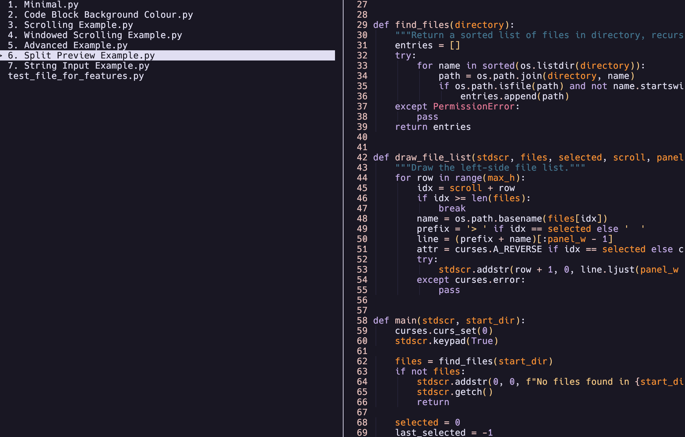

# Python Curses Syntax Highlighting

A Python library for displaying syntax-highlighted code in terminal applications using Python's curses library and Pygments for lexical analysis.



## Features

- **Syntax Highlighting**: Uses Pygments to support hundreds of programming languages
- **File and String Input**: Display a file by path or pass a string directly
- **Efficient Large File Handling**: Lazy loading with block-based caching
- **Theme**: Light/dark theme support
- **Optional Features**: Line numbers, indent guides, configurable display area, line wrapping or truncation
- **Character Width Aware**: Properly handles special characters using wcwidth

## Installation

```bash
pip install curses-syntax-highlighting
```

## Two Input Modes

| | Function | Input | Lexer detection |
|---|---|---|---|
| **File** | `preview_text(stdscr, filepath)` | Path to a file on disk | Automatic (from filename + content) |
| **String** | `preview_string(stdscr, text, language=)` | A string variable | You supply the language name |

Use `preview_text` when rendering files. Use `preview_string` when the code comes from a variable - fetched from an API, generated at runtime, stored in a database, etc.

> **Building an application?** This library is designed to be embedded in your own curses TUI — not used as a standalone viewer. See `examples/6. Split Preview Example.py` for a minimal pattern showing how to integrate syntax highlighting into an existing curses main loop without giving up control of key input.

## Quick Start

```python
import curses
from curses_syntax_highlighting import preview_text, preview_string

def main(stdscr):
    # From a file - lexer detected automatically
    preview_text(stdscr, 'example.py', show_line_numbers=True, theme='dark')
    stdscr.getch()

    # From a string - language supplied explicitly
    code = open('example.rs').read()
    preview_string(stdscr, code, language='rust', show_line_numbers=True)
    stdscr.getch()

curses.wrapper(main)
```

Both functions accept the same options: `code_x`, `code_y`, `code_w`, `code_h`, `show_line_numbers`, `indent_guides`, `theme` (`'dark'`/`'light'`), `wrap`, `bg_color`, `scroll_offset`. They return a viewer with a `total_lines` attribute useful for implementing scroll bounds.

## Pure Renderer - No Key Stealing

The library never calls `getch()`. Every function is a draw call that renders and returns immediately, leaving all input handling to your application:

```python
while True:
    preview_text(stdscr, filepath, scroll_offset=scroll)
    key = stdscr.getch()          # your app owns all input
    if key == curses.KEY_DOWN:
        scroll += 1
```

## API Reference

### High-Level Functions

#### `preview_text(stdscr, filepath, **options) → LazyFileViewer`

Display a syntax-highlighted **file**. Lexer is detected automatically. Loads lazily in blocks - suitable for large files. Returns `None` if the file is not found.

#### `preview_string(stdscr, text, language=None, **options) → TextViewer`

Display a syntax-highlighted **string**. `language` is a Pygments alias (`'python'`, `'rust'`, `'javascript'`, …); pass `None` for plain text. The string is tokenized upfront and held in memory.

#### `display_code(stdscr, viewer, token_to_color, code_x, code_y, code_w, code_h, show_line_numbers, indent_guides, scroll_offset=0, wrap=False)`

Low-level renderer. Accepts any viewer with a `get_lines(start, count)` method and a `total_lines` attribute.

#### `init_colors(theme_name='dark', start_color_id=200, bg_color=None)`

Initialize curses color pairs for a theme. Must be called after `curses.initscr()`. Color pair IDs start at 200 by default, leaving 1–199 free for your application.

### Classes

#### `LazyFileViewer(filepath, lexer, block_size=50)` · `TextViewer(text, lexer)`

Both expose `get_lines(start, count)` and `total_lines`. `LazyFileViewer` reads the file in blocks on demand; `TextViewer` tokenizes the full string upfront. Pass either to `display_code()`.

#### `get_lexer(filepath)` · `get_lexer_for_language(language)`

Detect a lexer from a file path or a language alias respectively.

## Themes

Two built-in themes: `'dark'` and `'light'`. Both default to the terminal's background color. Customize by editing `THEMES` in `curses_syntax_highlighting/themes.py`.

## Requirements

- Python 3.7+
- pygments >= 2.0.0
- wcwidth >= 0.2.0
